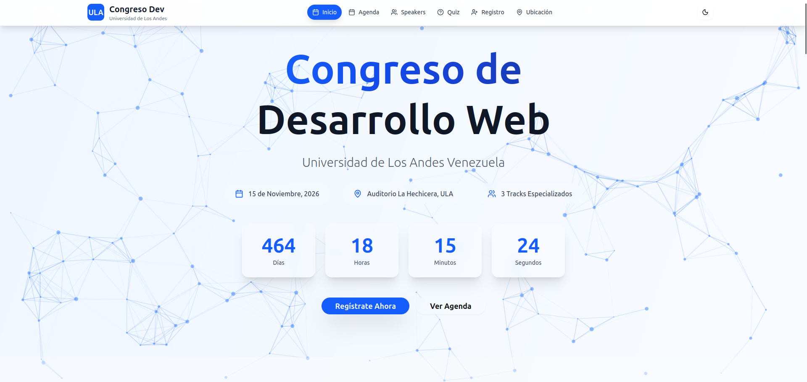
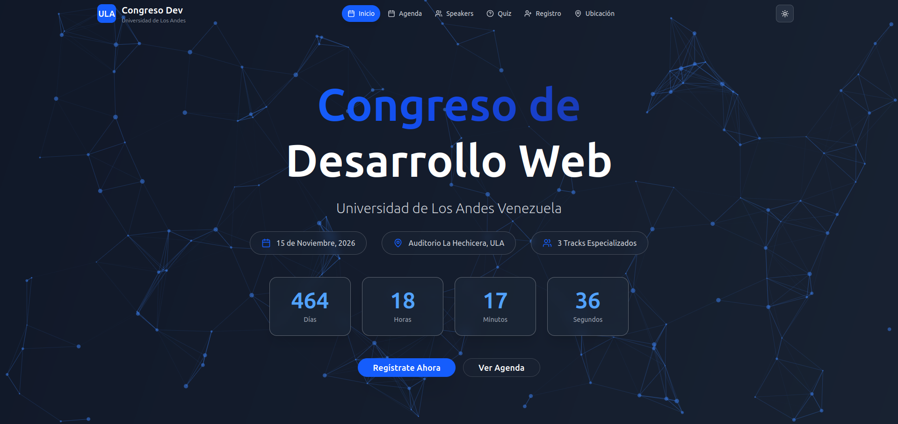

# 🚀 Congreso de Desarrollo Web - ULA  
*Landing Page Interactiva para Evento Ficticio de Tecnológico*  

## 📌 Descripción  
Landing page moderna para el **Congreso de Desarrollo Web - ULA**, un evento ficticio de tecnología organizado por la Universidad de Los Andes. Diseñada para promocionar charlas, speakers y permitir registros simulados, con un enfoque en:

  - Experiencia interactiva (animaciones, microinteracciones).
  - Datos dinámicos (agenda, speakers).
  - Buenas prácticas (componentes reutilizables, TypeScript).
  - Formulario de registro simulado.
  - Diseño 100% responsive

##  🛠 Tecnologías Clave
  - Frontend: React 19, Vite.
  - Tipado: TypeScript.
  - Animaciones: Framer Motion.
  - Estilos: TailwindCSS.

## ✨ Highlights

  1. Arquitectura limpia
      - Carpeta components bien organizada
      - Separación clara entre UI y lógica
  2. Detalles que marcan la diferencia
      - Efectos de hover en cards
      - Transiciones entre secciones
      - Loaders simulados para experiencia realista
  3. Código profesional
      - Tipado exhaustivo con TypeScript
      - Estilos con Tailwind

## 📸 Capturas

## 📝 Nota

Este proyecto es ficticio, creado con fines educativos.

**¡Inspirado en eventos reales como JSConf o React Summit!**
