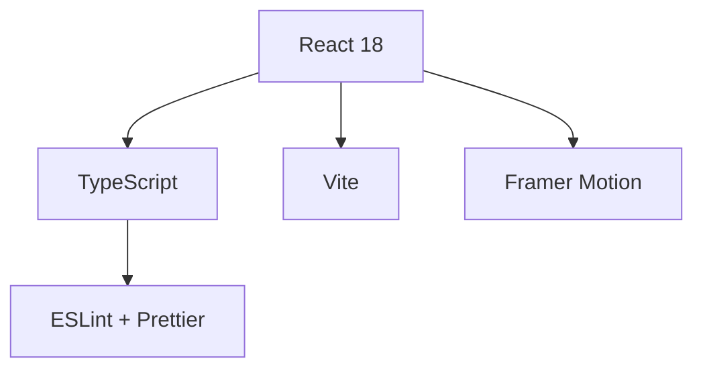

# 🚀 Congreso de Desarrollo Web - ULA  
*Landing Page para Evento Ficticio*  


## 📌 Descripción  
Landing page moderna para el **Congreso de Desarrollo Web - ULA**, un evento ficticio de tecnología organizado por la Universidad de Los Andes. Diseñada para promocionar charlas, speakers y permitir registros simulados, con un enfoque en:

  - Experiencia interactiva (animaciones, microinteracciones).
  - Datos dinámicos (agenda, speakers).
  - Buenas prácticas (componentes reutilizables, TypeScript).
  - Formulario de registro simulado.
  - Diseño 100% responsive

## ✨ Características Destacadas  

### 🎨 UI/UX Avanzada  
- Efectos de hover y scroll con Framer Motion  
- Modo oscuro/claro (Context API)  
- Microinteracciones con CSS Variables  

### ⚡ Tecnologías  



# 🌟 Congreso de Desarrollo Web - ULA  
*Landing Page Interactiva para Evento Tecnológico*  

[](https://congreso-web-ula.vercel.app/)


## 🎯 Impacto Visual  
Diseño moderno y profesional para un evento tecnológico ficticio, con:  
- **Hero section animada** con efecto parallax  
- **Cards interactivas** para speakers  
- **Paleta de colores profesional** (azules y morados tecnológicos)  
- **Totalmente responsive** (mobile, tablet, desktop)  

  
*Captura: Sección principal con CTA destacado*

## 🛠️ Tecnologías Clave  
### Frontend Avanzado  
- **React 18 + Vite**: Rendimiento optimizado  
- **TypeScript**: Tipado estricto en todos los componentes  
- **Tailwind CSS**: Diseño consistente con utility-first  
- **Framer Motion**: Animaciones fluidas en scroll y hover  

### Buenas Prácticas  
```mermaid
graph LR
    A[Componentes Modulares] --> B[Props tipadas]
    C[Custom Hooks] --> D[Lógica reutilizable]
    E[Data Fetching Simulado] --> F[JSON Local]